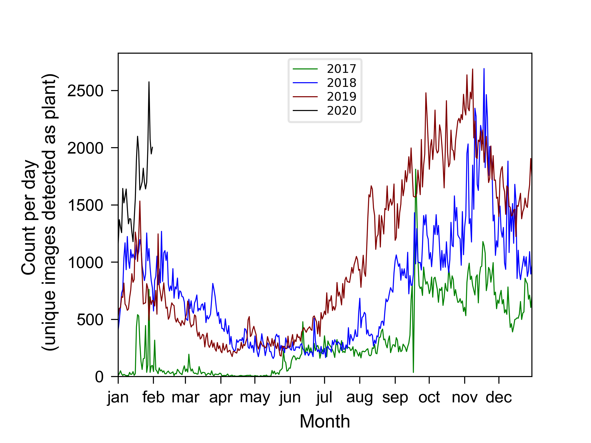
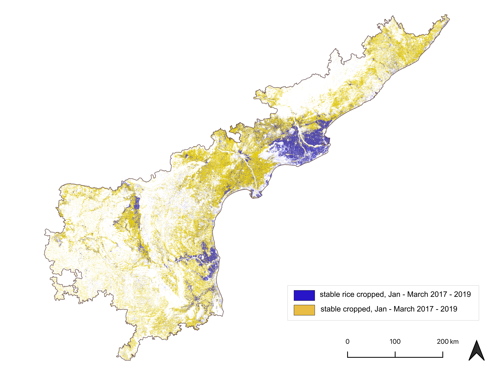

## Master thesis 
## Mapping cropped area in the rabi season of Andhra Pradesh between 2017 and 2019 using training data collected through the agtech platform Plantix
### Institute of Geography, HU Berlin, Winter Term 2019 - Summer Term 2020

This repository includes Python and GoogleEarth Engine scripts that I wrote in order to conduct my master thesis. 

Python was used for pre-processing steps as well as filtering (Pandas); tuning the parameters for my Random Forest classification and plotting of the raw/filtered data & results. 
The Google Earth Engine (Javscript) was used in order to process remotely sensed image data, generate training data out of existing global datasets and train Random Forest Classification models.

*Flowchart:*

*Crop photo submissions through the Android app "Plantix" from farmers located in Andhra Pradesh, India:*

*Classified map showing stable cropped area as well as rice cropped area*:

## Python Scripts: 
#### 1) Mongo DB Queries 
   * Scripts to query from PEAT's database for different locations and timeframes
#### 2) Data preprocessing 
   * Scripts to clean up and filter data using Pandas Module
#### 3) Cropnet testing 
   * Preprocessing 
   * Summary statistic
#### 4) Random Forest Parameter Tuning 
   * Grid Search
   * OOB error plot
   * OOB error score
   * Random Forest feature importance
#### 5) Time series plots
   * Submissions per day and year  
#### 6) Bar plots
   * Location accuracy within predefined ranges 
#### 5) Boxplots
   * User accuracy and producer accuracy per zone 

## GEE Scripts:
#### 1) Modules 
   * Modules for calculating a c
#### 2) Calculation of spectral-temporal metrics
  * Computation of cloud-free image composite
  * maximum NDVI stack
  * standard deviation NDVI stack
#### 3) Image data availability analysis per footprint and per pixel
  * daily mosaic of quality band
  * calculation of clear sky statistics
  * calculation of no data availability mask
  * cloudmasks for BQA_TOA and pixel_qa bands
#### 4) Training data processing
  * PEAT data filtering (AOI, time, exclude urban areas and major roads, thematic)
  * Water (JRC masking, eroding, random sampling)
  * Forest (stratified sampling for 5 classes, eroding, random sampling per class)
  * Urban (GUF eroding, random sampling)
  * Uncropped land (Checkup tool for manually selected points)
#### 5) Combine training datasets 
  * Combination of the training data to create feature matrix
    
#### 6) Supervised classification (Random Forest)
  * Sensitivity Analysis
    * validation feature matrix
    * model accuracy assessment
    * pixel statistics
    * zones accuracy assessment
    * RGB overlay map
    * computation of stable cropland estimates
  * Rice - Non rice mapping
    * generate rice training data
    * mask spectral-temporal metrics image with cropped area
    * rice classification
    * rice area statistics
 
#### 7) Model Validation
   * generate agro-climatic zones
   * stratified samples per zone
    
    
    
## Abstract
The agricultural sector of India represents an essential element in the challenge of ensuring global agricultural production and the farmer's livelihoods under changing weather patterns and growing population. About 70% of India's rural households still depend primarily on agriculture for their livelihood, with 82% being small and marginal farmers. However, detailed knowledge about the crop production of smallholders in India is rare. In order to fill these existing knowledge gaps, remote-sensing based information on cropped area in the different agricultural seasons could be a valuable auxiliary resource. The objective of this study was to map stable cropped area and its share of rice cropped area in India's federal state of Andhra Pradesh for the Rabi (dry) season of the years 2017 - 2019. Accounting for the large spatial and temporal variability of the onset of the Rabi season in Andhra Pradesh, a restricted timeframe (1 January to 31 March) was applied in order to cover the common main growing period of Rabi crops in Andhra Pradesh. Traditional methods to collect the required ground truth data are expensive and time-consuming. The potential to overcome these disadvantages of traditional data collection methods could lie in crowdsourced data collection methods as they provide large amounts of data at compara- tively low cost. As ground truth data for cropped area crowdsourced data provided by the agricultural-technol- ogy startup PEAT was utilized. The company receives large amounts of geotagged and timestamped image data of several crop varieties on a daily basis through the automatic image recognition feature of their smartphone application Plantix. To limit the PEAT data to a suitable reference dataset, the size of the raw dataset was sub- stantially reduced by applying several spatial and thematic filters. Nine different subsets of the PEAT data were generated in order to conduct a sensitivity analysis. Ancillary data for the remaining classes forming non- cropped area was obtained through several global datasets for woody canopy (Hansen et al. 2013), water (Pekel et al. 2016) and urban areas (Felbier et al. 2014) as well as manually collected in Google Earth Pro for unsown cropland, bare land and areas of sparse natural vegetation. I used Landsat 7 and Landsat 8 imagery to compute spectral-temporal metrics as basis for the classification utilizing Random Forest classifiers. The result for aggre- gated stable cropped area within the selected timeframe (5.7 Mha) was not in agreement with officially reported numbers for Rabi cropped area in 2017 - 2019 (1.7 - 2.06 Mha) revealing the unsuitable approach to map stable Rabi cropped area in the entire study region. The determined shares of rice cropped area were in better agree- ment with the official statistics with a deviation of +7.1%. The accuracy assessment of the individual maps shows the appropriate usability of extensively filtered crowdsourced PEAT data as ground truth data for cropped area with user's accuracies exceeding > 90%.
     
